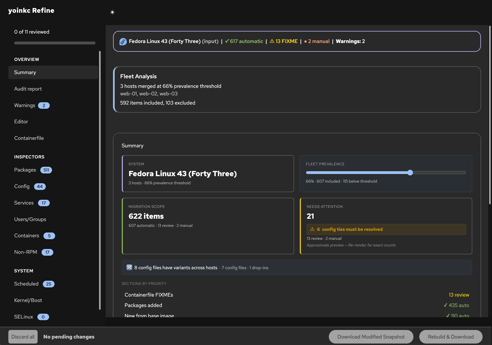
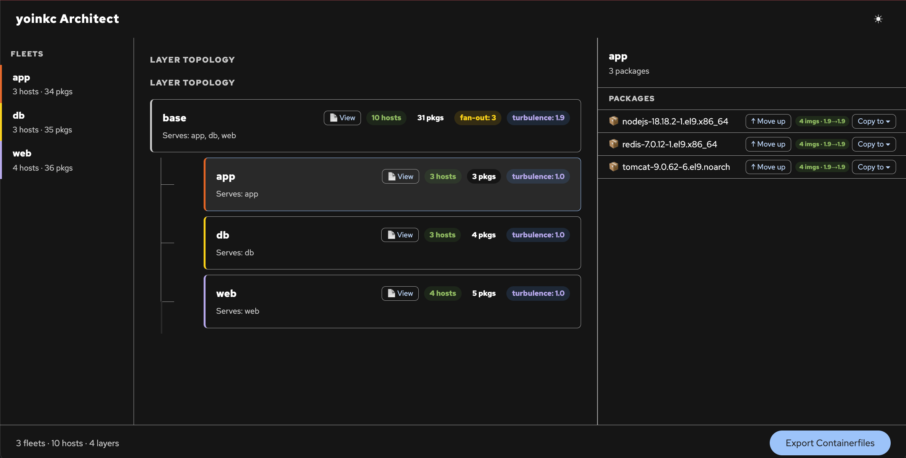

# inspectah

Scan package-based RHEL, CentOS Stream, and Fedora hosts and generate bootc image artifacts.

## What is inspectah?

inspectah scans a running RHEL, CentOS Stream, or Fedora host and generates everything you need to rebuild it as a [bootc](https://containers.github.io/bootc/) container image. bootc images are full operating system images managed and deployed as OCI containers — update your OS the same way you update your apps, with atomic upgrades and built-in rollback. inspectah figures out what you added to the base OS — packages, configs, services, users, cron jobs, container workloads — and generates only the delta. The output is a ready-to-build Containerfile, a config tree, an audit report, and an interactive HTML dashboard. Point it at a real server and get a real migration artifact.

> **Status:** inspectah is an active prototype. It handles common RHEL 9, CentOS Stream, and Fedora configurations well, but expect rough edges on unusual setups. It targets RPM-based systems only — no Debian, no RHEL 7, no live/in-place migration. See [driftify](https://github.com/marrusl/driftify) for a companion testing harness that validates inspectah end-to-end with synthetic drift.



*The Refine dashboard summarizes migration scope across a fleet — packages, configs, services, and system items — with automatic classification and an interactive editor.*

## Workflow

```
  One host:    Inspect ───► Refine ───► Build
  Many hosts:  Inspect ───► Fleet ────► Refine ───► Architect ───► Build

  Each step consumes and produces tarballs. Refine, Fleet, and Architect are optional.

  Inspect    inspectah scan                          Scan host, produce tarball
  Refine     inspectah refine *.tar.gz               Edit findings in the browser
  Fleet      inspectah fleet dir/ -p 80              Merge N hosts into one spec
  Architect  inspectah architect ./fleets/           Plan layer decomposition
  Build      inspectah build *.tar.gz -t tag         Build the bootc image
```

## Installation

### RPM (Fedora / RHEL / CentOS Stream)

```bash
sudo dnf copr enable marrusl/inspectah
sudo dnf install inspectah
```

Requires podman >= 4.4 (installed as a dependency if not present).

### Homebrew (macOS)

```bash
brew install marrusl/tap/inspectah
```

Requires podman to be installed separately (e.g. via [Podman Desktop](https://podman-desktop.io/) or `brew install podman`).

### From source

```bash
cd cmd/inspectah
go build -o inspectah .
sudo install inspectah /usr/local/bin/
```

### Configuration

| Variable | Effect |
|----------|--------|
| `INSPECTAH_IMAGE` | Override the container image (e.g. a local build or pinned tag) |
| `INSPECTAH_HOSTNAME` | Override the reported hostname |
| `INSPECTAH_DEBUG` | Set to `1` to enable debug logging |

The container image is published to `ghcr.io/marrusl/inspectah:latest` (multi-arch: amd64 + arm64). The Go CLI pulls it automatically on first run.

## Getting Started

### Inspect a host

```bash
sudo inspectah scan
```

A hostname-stamped tarball appears in your current directory (e.g. `webserver01-20260312-143000.tar.gz`). It contains the Containerfile, config tree, reports, and snapshot.

The Go CLI handles container image pulling and podman orchestration automatically.

> **`sudo` is required.** The container requires rootful podman for `nsenter` into host namespaces.

> **RHEL hosts:** Run `sudo podman login registry.redhat.io` first. The base image requires authentication. CentOS Stream and Fedora need no auth.

### Refine findings

After inspection, copy the tarball to your workstation and launch the interactive editor:

```bash
scp target-host:~/hostname-*.tar.gz .
inspectah refine hostname-*.tar.gz
```

The browser opens automatically with the Refine dashboard. From here you can:

- **Toggle items on/off** — exclude packages, config files, or services you don't want in the migration image
- **Search and filter** — use the search box on each card to find specific packages, files, or services; bulk Include All / Exclude All buttons work on filtered results
- **Review classifications** — inspectah auto-classifies items (base OS, user-added, config-modified); refine lets you override
- **Re-render** — click Re-render to regenerate the Containerfile, audit report, and all output artifacts with your changes applied
- **Download** — grab the updated tarball with your refinements baked in

Refine works on both single-host inspection tarballs and fleet-aggregated tarballs. For the single-host workflow (Inspect > Refine > Build), this is where you curate what goes into your bootc image before building. For fleets (Inspect > Fleet > Refine > Architect > Build), refine each fleet output before passing it to Architect.

The refine server runs on port 8642 by default. Use `--port` to change it, or `--no-browser` to skip auto-opening the browser. See [CLI Reference](docs/reference/cli.md#inspectah-refine) for all flags.

### Build the image

`inspectah build` builds bootc images from inspectah output, solving the problem of building RHEL images on non-RHEL hosts (Mac, Windows, Fedora). It auto-detects and bind-mounts RHEL subscription certs so `dnf install` works inside the build.

```bash
inspectah build hostname-20260312-143000.tar.gz -t my-bootc-image:latest
```

See `inspectah build --help` for all flags (entitlements, platform, dry-run, etc.).

## Output Artifacts

The default output is a tarball (`hostname-YYYYMMDD-HHMMSS.tar.gz`) containing:

```
hostname-20260312-143000.tar.gz
└── hostname-20260312-143000/
    ├── Containerfile                 # Layered image definition (cache-optimized)
    ├── README.md                     # Build/deploy commands, FIXME checklist
    ├── audit-report.md               # Detailed findings, storage plan, version drift
    ├── report.html                   # Self-contained interactive HTML dashboard
    ├── secrets-review.md             # Redacted sensitive content for review
    ├── kickstart-suggestion.ks       # Deploy-time config (conditional)
    ├── inspection-snapshot.json      # Raw structured data (re-renderable)
    ├── config/                       # Files to COPY into the image
    │   ├── etc/                      # Modified configs, repos, firewall, timers
    │   ├── opt/                      # Non-RPM software (venvs, npm apps, binaries)
    │   └── usr/                      # Files under /usr/local
    ├── quadlet/                      # Container workload unit files (conditional)
    ├── inspectah-users.toml             # bootc-image-builder user config (conditional)
    ├── entitlement/                  # RHEL subscription certs (conditional)
    └── rhsm/                         # RHEL subscription manager config (conditional)
```

Use `--output-dir` to get unpacked directory output instead.

## Fleet Aggregation

`inspectah fleet` merges inspection snapshots from multiple hosts serving the same role into a single fleet specification.

```bash
# Inspect each host
sudo INSPECTAH_HOSTNAME=web-01 inspectah scan
sudo INSPECTAH_HOSTNAME=web-02 inspectah scan
sudo INSPECTAH_HOSTNAME=web-03 inspectah scan

# Collect and aggregate
mkdir web-servers && cp web-0*.tar.gz web-servers/
inspectah fleet ./web-servers/ -p 80
```

The `-p` (prevalence threshold) controls inclusion. `-p 100` (default) means strict intersection — only items on every host. `-p 80` includes items on 80%+ of hosts. Items below threshold remain visible in the report but are excluded from the Containerfile.

The Go CLI runs everything inside the inspectah container automatically — no Python or pip required on your workstation.

See [CLI Reference](docs/reference/cli.md#inspectah-fleet) for the full flag list.

## Architect

`inspectah architect` takes multiple refined fleet outputs and decomposes them into a layered bootc image hierarchy: a shared base image plus derived role-specific images.

> **Early development:** Architect currently handles package list decomposition only. Config files, services, and other artifacts are not yet split across layers — they remain in the base. Multi-artifact layer planning is on the roadmap.



*Architect decomposes fleet packages into a layered image hierarchy — drag packages between layers, preview Containerfiles, and export the full build set.*

```bash
mkdir refined-fleets
cp web-servers-refined.tar.gz db-servers-refined.tar.gz refined-fleets/
inspectah architect ./refined-fleets/
```

The interactive web UI (default port 8643) lets you explore the proposed layer topology, move packages between layers, preview generated Containerfiles, and export the final set with an ordered build script.

See [CLI Reference](docs/reference/cli.md#inspectah-architect) for flags.

## See Also

- [CLI Reference](docs/reference/cli.md) — complete flag tables for all subcommands
- [Architecture](docs/explanation/architecture.md) — how inspectors, renderers, and baseline subtraction work
- [Design Document](docs/reference/design.md) — full technical design and schema reference
- [driftify](https://github.com/marrusl/driftify) — companion tool for applying synthetic drift to test inspectah end-to-end
- [bootc upstream](https://containers.github.io/bootc/) — bootc project documentation

## Shell Script (Legacy)

The `run-inspectah.sh` wrapper still works for one-off use on hosts where you cannot install the Go CLI, but it lacks error translation, tab completion, and the build subcommand.

```bash
curl -fsSL -o run-inspectah.sh https://raw.githubusercontent.com/marrusl/inspectah/main/run-inspectah.sh
chmod +x run-inspectah.sh
sudo ./run-inspectah.sh
```

## License

MIT — see [LICENSE](LICENSE).
